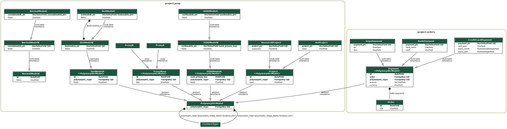

# django-polymorphic

[](https://travis-ci.org/django-polymorphic/django-polymorphic)
[](https://pypi.python.org/pypi/django-polymorphic)
[](https://codecov.io/github/django-polymorphic/django-polymorphic?branch=master)
[](https://django-polymorphic.readthedocs.io/en/stable/)

- Release: 2.1.2
- [Repository](https://github.com/django-polymorphic/django-polymorphic)
- [Docs](https://django-polymorphic.readthedocs.io)

## TODO

- Add [django-rest-polymorphic](https://github.com/apirobot/django-rest-polymorphic)
- Add [mptt](https://github.com/django-polymorphic/django-polymorphic-tree)
- Add [django-reversion](https://github.com/etianen/django-reversion)
- Add [django-guardian](https://github.com/django-guardian/django-guardian)

## Installation

```shell
cd django-polymorphic
pip install -r requirements.txt

# Apply migrate
./manage.py migrate

# load default admin account (login: admin/ password: pass)
./manage.py loaddata ../fixtures/superuser.json

# Run server:
./manage.py runserver --insecure 127.0.0.1:8000
```

## DB Schema

```shell
./manage.py graph_models -g -o myapp_models.png orders pexp			
```



## SQL (for sqlite)

```shell
./manage.py sqlmigrate orders 0001_initial			
```

```sql
BEGIN;
CREATE TABLE "orders_order" ("id" integer NOT NULL PRIMARY KEY AUTOINCREMENT, "title" varchar(200) NOT NULL);
CREATE TABLE "orders_payment" ("id" integer NOT NULL PRIMARY KEY AUTOINCREMENT, "currency" varchar(3) NOT NULL, "amount" decimal NOT NULL);
CREATE TABLE "orders_bankpayment" ("payment_ptr_id" integer NOT NULL PRIMARY KEY REFERENCES "orders_payment" ("id") DEFERRABLE INITIALLY DEFERRED, "bank_name" varchar(100) NOT NULL, "swift" varchar(20) NOT NULL);
CREATE TABLE "orders_creditcardpayment" ("payment_ptr_id" integer NOT NULL PRIMARY KEY REFERENCES "orders_payment" ("id") DEFERRABLE INITIALLY DEFERRED, "card_type" varchar(10) NOT NULL, "expiry_month" smallint unsigned NOT NULL CHECK ("expiry_month" >= 0), "expiry_year" integer unsigned NOT NULL CHECK ("expiry_year" >= 0));
CREATE TABLE "orders_sepapayment" ("payment_ptr_id" integer NOT NULL PRIMARY KEY REFERENCES "orders_payment" ("id") DEFERRABLE INITIALLY DEFERRED, "iban" varchar(34) NOT NULL, "bic" varchar(11) NOT NULL);
CREATE TABLE "new__orders_payment" ("id" integer NOT NULL PRIMARY KEY AUTOINCREMENT, "currency" varchar(3) NOT NULL, "amount" decimal NOT NULL, "order_id" integer NOT NULL REFERENCES "orders_order" ("id") DEFERRABLE INITIALLY DEFERRED);
INSERT INTO "new__orders_payment" ("id", "currency", "amount", "order_id") SELECT "id", "currency", "amount", NULL FROM "orders_payment";
DROP TABLE "orders_payment";
ALTER TABLE "new__orders_payment" RENAME TO "orders_payment";
CREATE INDEX "orders_payment_order_id_bdccf250" ON "orders_payment" ("order_id");
CREATE TABLE "new__orders_payment" ("id" integer NOT NULL PRIMARY KEY AUTOINCREMENT, "currency" varchar(3) NOT NULL, "amount" decimal NOT NULL, "order_id" integer NOT NULL REFERENCES "orders_order" ("id") DEFERRABLE INITIALLY DEFERRED, "polymorphic_ctype_id" integer NULL REFERENCES "django_content_type" ("id") DEFERRABLE INITIALLY DEFERRED);
INSERT INTO "new__orders_payment" ("id", "currency", "amount", "order_id", "polymorphic_ctype_id") SELECT "id", "currency", "amount", "order_id", NULL FROM "orders_payment";
DROP TABLE "orders_payment";
ALTER TABLE "new__orders_payment" RENAME TO "orders_payment";
CREATE INDEX "orders_payment_order_id_bdccf250" ON "orders_payment" ("order_id");
CREATE INDEX "orders_payment_polymorphic_ctype_id_31afec8d" ON "orders_payment" ("polymorphic_ctype_id");
COMMIT;
```

```shell
./manage.py sqlmigrate pexp 0001_initial			
```

```sql
BEGIN;

CREATE TABLE "pexp_normalmodela" ("id" integer NOT NULL PRIMARY KEY AUTOINCREMENT, "field1" varchar(10) NOT NULL);
CREATE TABLE "pexp_project" ("id" integer NOT NULL PRIMARY KEY AUTOINCREMENT, "topic" varchar(30) NOT NULL, "polymorphic_ctype_id" integer NULL REFERENCES "django_content_type" ("id") DEFERRABLE INITIALLY DEFERRED);
CREATE TABLE "pexp_testmodela" ("id" integer NOT NULL PRIMARY KEY AUTOINCREMENT, "field1" varchar(10) NOT NULL, "polymorphic_ctype_id" integer NULL REFERENCES "django_content_type" ("id") DEFERRABLE INITIALLY DEFERRED);
CREATE TABLE "pexp_uuidmodela" ("uuid_primary_key" char(32) NOT NULL PRIMARY KEY, "field1" varchar(10) NOT NULL, "polymorphic_ctype_id" integer NULL REFERENCES "django_content_type" ("id") DEFERRABLE INITIALLY DEFERRED);
CREATE TABLE "pexp_artproject" ("project_ptr_id" integer NOT NULL PRIMARY KEY REFERENCES "pexp_project" ("id") DEFERRABLE INITIALLY DEFERRED, "artist" varchar(30) NOT NULL);
CREATE TABLE "pexp_normalmodelb" ("normalmodela_ptr_id" integer NOT NULL PRIMARY KEY REFERENCES "pexp_normalmodela" ("id") DEFERRABLE INITIALLY DEFERRED, "field2" varchar(10) NOT NULL);
CREATE TABLE "pexp_researchproject" ("project_ptr_id" integer NOT NULL PRIMARY KEY REFERENCES "pexp_project" ("id") DEFERRABLE INITIALLY DEFERRED, "supervisor" varchar(30) NOT NULL);
CREATE TABLE "pexp_testmodelb" ("testmodela_ptr_id" integer NOT NULL PRIMARY KEY REFERENCES "pexp_testmodela" ("id") DEFERRABLE INITIALLY DEFERRED, "field2" varchar(10) NOT NULL);
CREATE TABLE "pexp_uuidmodelb" ("uuidmodela_ptr_id" char(32) NOT NULL PRIMARY KEY REFERENCES "pexp_uuidmodela" ("uuid_primary_key") DEFERRABLE INITIALLY DEFERRED, "field2" varchar(10) NOT NULL);
CREATE TABLE "pexp_proxybase" ("id" integer NOT NULL PRIMARY KEY AUTOINCREMENT, "title" varchar(200) NOT NULL, "polymorphic_ctype_id" integer NULL REFERENCES "django_content_type" ("id") DEFERRABLE INITIALLY DEFERRED);
CREATE TABLE "pexp_normalmodelc" ("normalmodelb_ptr_id" integer NOT NULL PRIMARY KEY REFERENCES "pexp_normalmodelb" ("normalmodela_ptr_id") DEFERRABLE INITIALLY DEFERRED, "field3" varchar(10) NOT NULL);
CREATE TABLE "pexp_uuidmodelc" ("uuidmodelb_ptr_id" char(32) NOT NULL PRIMARY KEY REFERENCES "pexp_uuidmodelb" ("uuidmodela_ptr_id") DEFERRABLE INITIALLY DEFERRED, "field3" varchar(10) NOT NULL);
CREATE TABLE "pexp_testmodelc" ("testmodelb_ptr_id" integer NOT NULL PRIMARY KEY REFERENCES "pexp_testmodelb" ("testmodela_ptr_id") DEFERRABLE INITIALLY DEFERRED, "field3" varchar(10) NOT NULL);
CREATE TABLE "pexp_testmodelc_field4" ("id" integer NOT NULL PRIMARY KEY AUTOINCREMENT, "testmodelc_id" integer NOT NULL REFERENCES "pexp_testmodelc" ("testmodelb_ptr_id") DEFERRABLE INITIALLY DEFERRED, "testmodelb_id" integer NOT NULL REFERENCES "pexp_testmodelb" ("testmodela_ptr_id") DEFERRABLE INITIALLY DEFERRED);

CREATE INDEX "pexp_project_polymorphic_ctype_id_37e6df0b" ON "pexp_project" ("polymorphic_ctype_id");
CREATE INDEX "pexp_testmodela_polymorphic_ctype_id_3a443740" ON "pexp_testmodela" ("polymorphic_ctype_id");
CREATE INDEX "pexp_uuidmodela_polymorphic_ctype_id_57a10024" ON "pexp_uuidmodela" ("polymorphic_ctype_id");
CREATE INDEX "pexp_proxybase_polymorphic_ctype_id_238f0bc0" ON "pexp_proxybase" ("polymorphic_ctype_id");
CREATE UNIQUE INDEX "pexp_testmodelc_field4_testmodelc_id_testmodelb_id_e3ae4a66_uniq" ON "pexp_testmodelc_field4" ("testmodelc_id", "testmodelb_id");
CREATE INDEX "pexp_testmodelc_field4_testmodelc_id_b4beffec" ON "pexp_testmodelc_field4" ("testmodelc_id");
CREATE INDEX "pexp_testmodelc_field4_testmodelb_id_4f87cff9" ON "pexp_testmodelc_field4" ("testmodelb_id");
COMMIT;
```